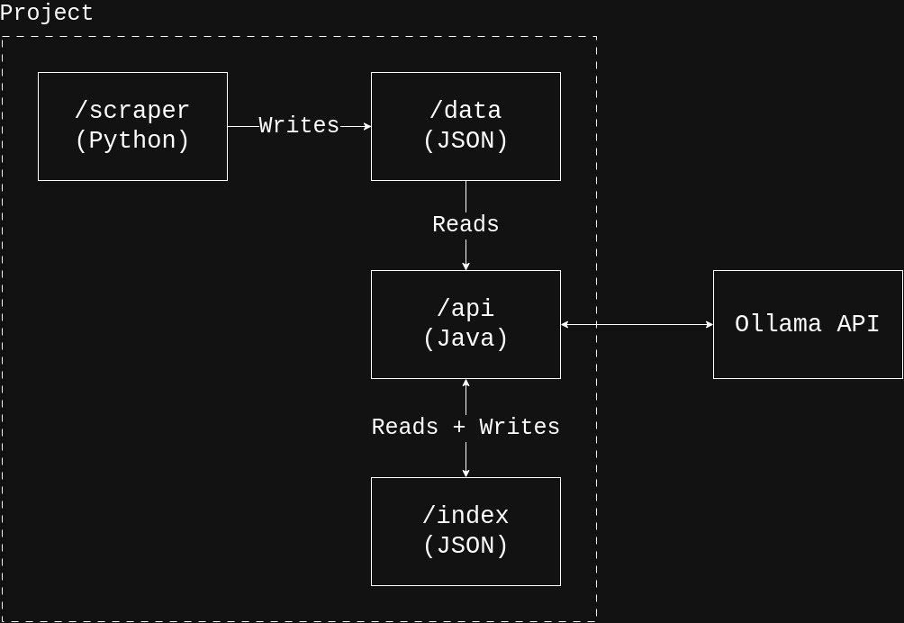

# SMITE 2 Build Recommender

A retrieval-augmented generation (RAG) system that recommends SMITE 2 item builds
for a given god, grounded in scraped wiki data and served through a local LLM
(hosted via Ollama); built as a learning project bridging Spring Boot, testing,
CI and RAG techniques.

Everything runs locally and for free, we don't make use of external APIs. The
trade-off is that responses is of local-model quality, and performance is determined
by the quality of the machine running the LLM.

## Tech Stack
- **Scraper:** Python, `requests`, `bs4`
- **API:** Java 25, Maven, Spring Boot, Jackson, Lombok
- **Models:** `nomic-embed-text` (embeddings), `qwen3:14b` (generation); both served via Ollama
- **Vector Storage:** no vector database was used due to the small scale of the dataset
- **Testing:** JUnit 5, Mockito, MockMvc, AssertJ

## Architecture
The project has two independent components, connected by a shared, on-disk, directory.

<p align="center">
    
</p>

- `scraper/` - the first main component. Pulls god and item data from the SMITE 2 wiki (https://wiki.smite2.com/)
and writes structured data to `data/`
- `api/` - the second main component. Makes use of structured data from `data/` to build and query a vector index
which we store in `index/`. We did not use a vector database as it seemed unnecessary at this scale.

## How a Recommendation is produced
1. A free-text query is received via `POST /recommend`.
2. **Decoding:** an LLM call is used in order to extract structured intent data from the query, e.g. gods (player god and opponent gods), wanted items, items to avoid, etc.
3. **Retrieval:** the structured intent data is used to retrieve relevant chunks from the index. Some lookups are exact (e.g. god lookups), others make use of cosine similarity using the embedding vectors.
4. **Prompt Assembly:** retrieved chunks are combined with domain knowledge and the user's query into a prompt, with instructions specific to the query type.
5. **Generation:** the prompt is sent to the Ollama model which generates and returns the response.

## Setup
### 1. Prerequisites
Ensure the following are installed:
- Java 25
- Maven
- Python 1.13+
- Ollama (local)
### 2. Scraping
- Setup Python environment and install requirements
```bash
pip install -r scraper/requirements.txt
```
- Scrape the most recent data
```bash
python scraper -m patch-label
```
### 3. Setting up Ollama
- Run the server
```bash
ollama serve
```
- In a different terminal, install the required models
```bash
ollama pull nomic-embed-text
ollama pull qwen3:14b
```
### 4. Run the API
```bash
cd api
mvn spring-boot:run
```

## API
### Endpoints
| Method | Path | Description |
| ------ | ---- | ----------- |
| `GET`  | `/gods` | List all gods |
| `GET` | `/gods/{name}` | Full detail for a single god |
| `GET` | `/items` | List all items |
| `GET` | `/items/{name}` | Full detail for a single item |
| `POST` | `/recommend` | Query about build recommendations / item synergy / general answer |

`POST /recommend` expects JSON with a single `query` field. For example, if the
API were running on `localhost:8080`, a valid request sent by `curl` would be:
```bash
curl -X POST http://localhost:8080/recommend \
    -H "Content-Type: application/json"
    -d '{"query": "Give me a build for Nu Wa"}'
```

## Testing
To run the main test suite (sans integration tests):
```bash
mvn test
```
These tests are fast, deterministic and do not make use of external services or data.
Additionally, these tests are ran using Github Actions on every push/PR to `main` (see `.github/workflows`).

To run integration tests:
```bash
mvn test -Dgroups=integration -DexcludedGroups=
```
These make use of both external data and the Ollama API. Due to the indeterminism
of LLM output, integration test failures do not necessarily indicate a regression.
Due to the dependence on Ollama, these tests **are not** run via Github Actions.
